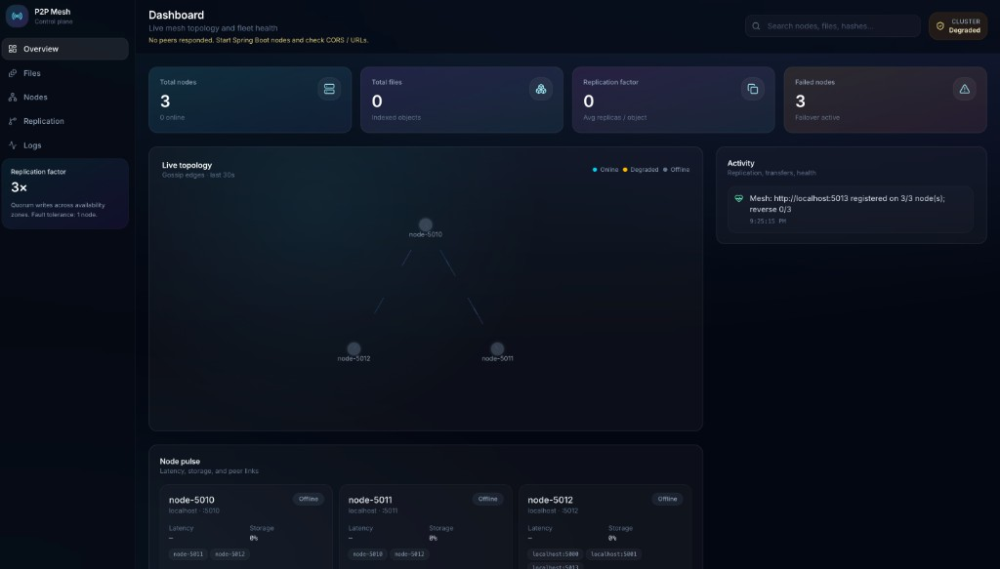
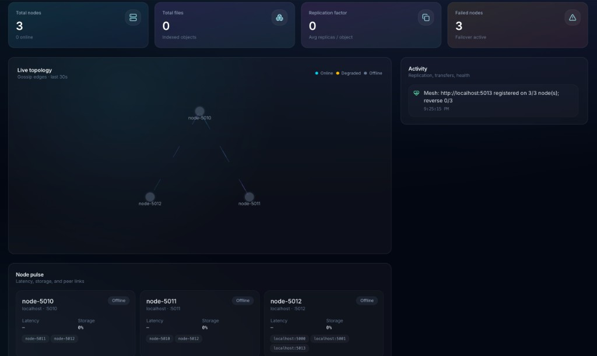

# p2p-system

Système distribué de partage de fichiers **pair-à-pair** avec réplication et tolérance aux pannes simplifiée : nœuds **Spring Boot** autonomes et **interface React** de supervision.

## Interface

Console web **P2P Mesh Control Plane** : tableau de bord (topologie, activité, état des nœuds).

## Documentation

- **[Architecture et conception (`docs/ARCHITECTURE.fr.md`)](./docs/ARCHITECTURE.fr.md)** — vue d’ensemble, diagrammes, backend, frontend, API, limites et pistes d’évolution.

## Démarrage rapide

- **Backend** : voir [`backend/README.md`](./backend/README.md) (profils `node5010`, `node5011`, `node5012`).
- **Frontend** : voir [`frontend/README.md`](./frontend/README.md) (`npm install`, `npm run dev`, variables `VITE_*`).

## Structure du dépôt

| Répertoire  | Description                      |
| ----------- | -------------------------------- |
| `backend/`  | Application Spring Boot par nœud |
| `frontend/` | Console web Vite + React         |
| `docs/`     | Documentation technique          |
