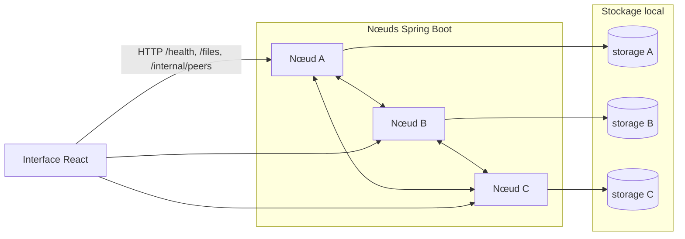

# Documentation technique — Système P2P de partage de fichiers avec réplication

Ce document décrit la conception, l’architecture et le fonctionnement du dépôt **p2p-system** : un ensemble de nœuds Spring Boot autonomes et une interface web React utilisée pour observer et piloter le maillage en développement.

---

## 1. Objectifs et périmètre

Le système simule un **réseau pair-à-pair** pour le stockage et la diffusion de fichiers **sans serveur central** de métadonnées ni de stockage partagé :

- chaque **nœud** est un processus JVM indépendant ;
- les données résident dans un **répertoire local** sur le disque du nœud ;
- la **réplication** se fait par appels HTTP entre pairs ;
- la **recherche distribuée** permet de récupérer un fichier absent du disque local en interrogeant les pairs connus.

L’interface **frontend** ne fait pas office de coordinateur : elle **interroge** plusieurs nœuds (santé, liste des fichiers, pairs) depuis le navigateur et agrège la vue pour l’opérateur.

---

## 2. Vue d’ensemble logique

**Légende :** les flèches entre nœuds représentent la communication applicative (réplication, téléchargement depuis un pair). Le frontend parle **directement** aux API REST des nœuds exposés (localhost, réseau local selon configuration CORS).

---

## 3. Architecture du backend (Spring Boot)

### 3.1 Découpage en couches

| Couche            | Rôle                                                                                                                                                                                                                |
| ----------------- | ------------------------------------------------------------------------------------------------------------------------------------------------------------------------------------------------------------------- |
| **Contrôleurs**   | Exposition HTTP : fichiers (`FileController`), santé (`HealthController`), administration des pairs (`PeerAdminController`).                                                                                        |
| **Services**      | Logique métier : stockage local et hachage (`FileService`), réplication (`ReplicationService`), client HTTP vers les pairs (`PeerClient`), registre des URLs (`PeerRegistry`), métriques Micrometer (`P2pMetrics`). |
| **Configuration** | `NodeConfig` (YAML), CORS, client REST, exécuteurs asynchrones pour la réplication.                                                                                                                                 |
| **Stockage**      | Fichiers sur disque, métadonnées calculées (taille, SHA-256, horodatage). Pas de base de données relationnelle.                                                                                                     |

### 3.2 Registre des pairs (`PeerRegistry`)

- Les pairs sont initialisés à partir du fichier **`application.yml`** (liste `node.peers`).
- Ils peuvent être **enrichis à l’exécution** via l’API `/internal/peers` (POST/DELETE).
- Les URL pointant vers **le nœud lui-même** sont ignorées ou refusées pour éviter les boucles de réplication et les auto-requêtes.

### 3.3 Cycle de vie d’un fichier

**Upload (`POST /files/{filename}`)**

1. Le corps de la requête est écrit sur le disque local.
2. Si la requête **n’est pas** marquée comme réplicat (`X-Replicated: false`), le service déclenche la **réplication** vers tous les pairs du registre.
3. Si `X-Replicated: true`, le fichier est stocké **sans** relancer une nouvelle vague de réplication (prévention des boucles infinies).

**Téléchargement (`GET /files/{filename}`)**

1. Lecture locale si le fichier existe.
2. Sinon, **parcours séquentiel** des pairs : le `PeerClient` interroge chaque pair jusqu’à la première réponse positive.
3. Le contenu récupéré peut être **mis en cache localement** avec `X-Replicated: true` pour ne pas relancer une réplication globale.

### 3.4 Réplication (`ReplicationService`)

- **Fan-out** vers l’ensemble des pairs enregistrés (hors soi).
- Paramétrable : **parallèle ou séquentiel**, **synchrone ou asynchrone** (`CompletableFuture` sur un exécuteur dédié), **nombre de tentatives** et **délai** entre essais.
- Les échecs sur un pair n’arrêtent pas les autres ; le service journalise et enregistre des métriques.

### 3.5 Observabilité

- Santé applicative : `GET /health` (identifiant du nœud, statut).
- Actuator : métriques (`/actuator/metrics`), santé Spring, export **Prometheus** selon configuration.

### 3.6 Fichiers de configuration

- **`application.yml`** : valeurs par défaut (port 5010, stockage, pairs, timeouts, CORS).
- **Profils** `application-node5010.yml`, `node5011`, `node5012` : permettent de lancer trois instances locales avec ports et répertoires distincts.

---

## 4. Architecture du frontend (React + Vite)

### 4.1 Rôle

L’application est une **console d’observation et d’action** :

- tableaux de bord (graphe, cartes nœuds, métriques agrégées) ;
- gestion des fichiers (liste dérivée des réponses `/files`, upload, téléchargement) ;
- gestion des nœuds (activation simulée, ajout/suppression de pairs via `/internal/peers`) ;
- suivi des opérations de réplication côté UI (file d’événements et rejouage manuel dans certains cas).

### 4.2 Données et synchronisation

- **`DataContext`** interroge périodiquement chaque URL configurée (`VITE_P2P_NODE_URLS`, par défaut les ports 5010–5012) : `GET /health`, `GET /files`, `GET /internal/peers`.
- Les réponses sont **fusionnées** pour construire une vue cluster (nœuds, arêtes entre pairs connus, fichiers avec ensemble de détenteurs).
- Un bouton de **rafraîchissement manuel** peut déclencher le même cycle sans attendre l’intervalle de polling.
- Les états « nœud hors ligne » utilisent une **mémoire locale** du dernier état connu pour afficher de façon dégradée les nœuds précédemment vus.

### 4.3 Navigation

Routes principales : accueil (dashboard), fichiers, nœuds, réplication, journaux. Le routage est géré par **React Router** ; l’état global mesh est fourni par un **Context** React.

### 4.4 Contraintes navigateur

Le frontend appelle les nœuds **depuis le navigateur** : le serveur Spring Boot doit autoriser l’**origine** du front (configuration **`p2p.cors.allowed-origin-patterns`**, adaptée au port Vite ou à un hôte réseau).

---

## 5. Modèle d’API REST (résumé)

| Méthode  | Chemin                    | Description                                                                       |
| -------- | ------------------------- | --------------------------------------------------------------------------------- |
| `POST`   | `/files/{filename}`       | Corps binaire ; en-tête `X-Replicated` pour distinguer réplicat / upload initial. |
| `GET`    | `/files/{filename}`       | Téléchargement local ou depuis un pair.                                           |
| `GET`    | `/files`                  | Liste JSON des métadonnées des fichiers locaux.                                   |
| `GET`    | `/health`                 | État et identifiant du nœud.                                                      |
| `GET`    | `/internal/peers`         | Liste des URL des pairs.                                                          |
| `POST`   | `/internal/peers`         | Corps JSON `{ "url": "http://..." }` pour enregistrer un pair.                    |
| `DELETE` | `/internal/peers?url=...` | Retrait d’un pair.                                                                |

Les chemins sous **`/actuator`** suivent les conventions Spring Boot pour la supervision.

---

## 6. Tolérance aux pannes et limites assumées

**Ce qui est géré :**

- indisponibilité d’un ou plusieurs pairs lors de la réplication (meilleur effort) ;
- téléchargement via un autre pair si le fichier n’est pas local ;
- absence temporaire de nœuds : le front signale une erreur de poll globale si aucun pair ne répond.

**Limites (simulation / prototype) :**

- pas de consensus distribué ni de quorum strict pour l’écriture ;
- pas d’authentification sur les API (les endpoints `/internal/peers` seraient à protéger en production) ;
- cohérence **à terme** via réplication asynchrone, pas de garantie de synchronisation instantanée sur tous les nœuds ;
- le frontend agrège par nom de fichier : scénarios de collision ou de versions concurrentes ne sont pas gérés au niveau métier avancé.

---

## 7. Déploiement et exécution (rappel)

- **Backend** : Java 17+, Maven ; profils Spring pour plusieurs ports. Voir `backend/README.md` pour les commandes typiques.
- **Frontend** : Node.js ; variables d’environnement **`VITE_P2P_NODE_URLS`** et **`VITE_TARGET_REPLICAS`** pour aligner l’UI sur le nombre de réplicas attendu pour la couleur d’état des fichiers.

---

## 8. Fichiers et répertoires utiles pour la navigation du code

| Emplacement                                      | Contenu principal                                                 |
| ------------------------------------------------ | ----------------------------------------------------------------- |
| `backend/src/main/java/com/p2p/node/service/`    | `FileService`, `ReplicationService`, `PeerClient`, `PeerRegistry` |
| `backend/src/main/java/com/p2p/node/controller/` | REST public et interne                                            |
| `backend/src/main/resources/`                    | YAML de configuration                                             |
| `frontend/src/context/DataContext.tsx`           | Agrégation cluster et actions utilisateur                         |
| `frontend/src/api/p2pClient.ts`                  | Appels HTTP vers les nœuds                                        |
| `frontend/src/config.ts`                         | Constantes d’environnement Vite                                   |

---

## 9. Conclusion

Le système illustre une **architecture décentralisée à base de pairs HTTP** : chaque nœud porte sa vérité locale, coopère par réplication et recherche séquentielle, et l’interface React fournit une **vue transverse** sans devenir un point central de contrôle des données. Pour un déploiement réel, il faudrait renforcer la sécurité, la stratégie de réplication (nombre de copies, déduplication, conflits) et possiblement un mécanisme de découverte de pairs au-delà des listes statiques et des enregistrements manuels.
