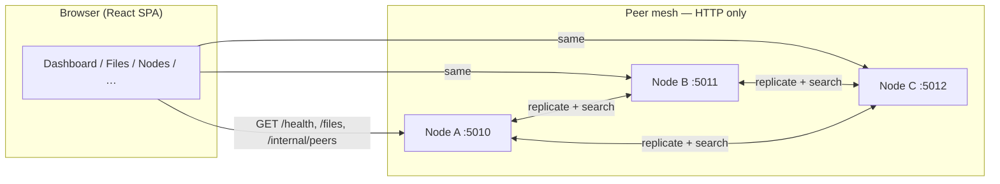
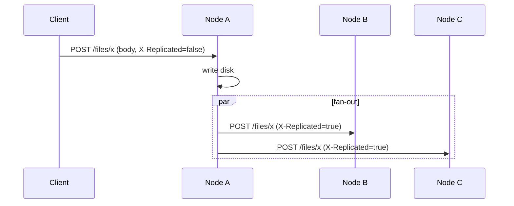
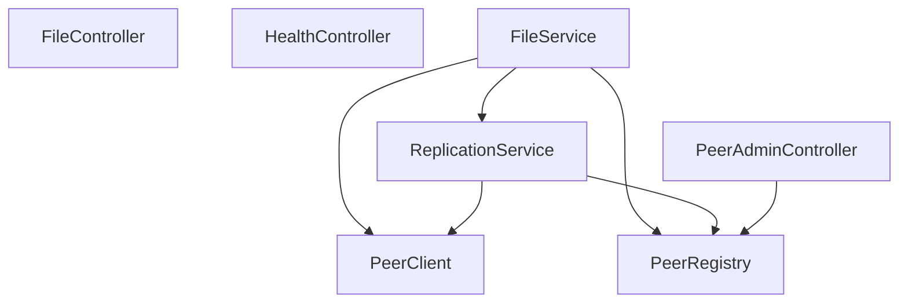

# Architecture — Distributed P2P File Sharing

This document describes the **system design**, **major components**, and **runtime behavior** of the `p2p-system` repository: a small **decentralized file-sharing simulation** built as **independent Spring Boot peers** plus a **React observability dashboard** that talks to them over HTTP from the browser.

---

## 1. Goals and scope

| Goal | How it is addressed |
|------|---------------------|
| No single central file server | Each node is a full Spring Boot process with its own disk storage and peer list. |
| Replication | On upload, the storing node **fans out** copies to peers via HTTP POST. |
| Fault tolerance | Peer failures are **best-effort**: replication and search skip or retry per configuration; the cluster degrades instead of stopping outright. |
| Distributed lookup | If a file is missing locally, the node **queries peers sequentially** until one returns the blob. |
| Visibility / control | The SPA polls nodes and exposes mesh state, files, simulated “drain,” and optional **dynamic peer registration** from the UI. |

**Non-goals (current design):** Byzantine fault tolerance, consensus, encryption in transit beyond HTTPS in production, strong authentication on admin APIs, global namespace partitioning, or chunking/streaming of very large files beyond Tomcat limits. The stack is suitable for **labs and demos**, not as a production global datastore.

---

## 2. High-level system context

The UI does **not** implement a P2P protocol itself: it is an **operator console** that discovers state by calling each node’s **public REST APIs**. Peers talk to each other **server-to-server** using the same REST surface (`RestTemplate`).

---

## 3. Backend: Spring Boot peer node

### 3.1 Layered structure

| Layer | Responsibility |
|--------|-----------------|
| **Controllers** | HTTP mapping: files, health, internal peer admin. |
| **Services** | `FileService` (storage + orchestration), `ReplicationService` (fan-out), `PeerClient` (HTTP to peers), `PeerRegistry` (peer URLs), `P2pMetrics` (Micrometer). |
| **Config** | `NodeConfig` (YAML `node.*`), CORS, `RestTemplate` timeouts, async executors. |
| **Storage** | Local directory on disk; filenames validated; metadata includes SHA-256 for integrity. |

Package layout (conceptual):

- `com.p2p.node.controller` — REST adapters  
- `com.p2p.node.service` — domain logic and peer I/O  
- `com.p2p.node.config` — Spring wiring and properties  
- `com.p2p.node.model` / `exception` / `util` — supporting types  

### 3.2 Peer registry

`PeerRegistry` holds the **current list of peer base URLs**:

- **Seeded** from `node.peers` in YAML at startup.  
- **Extended** at runtime via `POST/DELETE /internal/peers` (the UI uses this for “add/remove peer”).  
- **Self-URLs are rejected** so a node never registers or replicates to itself.

### 3.3 Upload and replication

When a client **POST**s a file to `/files/{filename}` **without** signaling a replica, `FileService` persists the blob and asks `ReplicationService` to push it to **every** peer in the registry.

Important behaviors:

- **`X-Replicated: true`** on ingest means “this body came from another node’s replication hop” → **no further fan-out** (loop prevention).  
- Replication can run **async** and **in parallel** (configurable), with **retries** per peer.  
- Failures on one peer do not necessarily fail the HTTP response to the original uploader (async path).

### 3.4 Download and distributed search

`GET /files/{filename}` resolves bytes in order:

1. **Local file** on disk → return.  
2. Else **iterate peers** (same order as replication peers) and **GET** from each until a non-empty body is returned.  
3. Optionally **cache** the blob locally with `alreadyReplicated=true` so the copy does not re-trigger fan-out.  
4. If nothing succeeds → **404** / not found.

This is **O(peers)** linear search, not a DHT.

### 3.5 Observability and ops hooks

- **`GET /health`** — lightweight JSON including node id (used by the SPA).  
- **Actuator** — `/actuator/health`, `/actuator/metrics`, Prometheus scrape, and custom meters where implemented.  

### 3.6 Configuration and profiles

Each process is configured via **`application.yml`** plus **Spring profiles** (e.g. `node5010`, `node5011`, `node5012`) that set port, `node.id`, storage path, and static `node.peers`. Environment variable overrides follow Spring relaxed binding.

---

## 4. Frontend: React dashboard

### 4.1 Role

The SPA **does not** participate in replication. It:

- Reads **`VITE_P2P_NODE_URLS`** (comma-separated base URLs).  
- **Polls** each URL on an interval (`DataContext`: health, file list, peer list).  
- Merges results into a **unified graph**: nodes, edges (when peer ids align), file inventory across nodes, and **replication factor**-style metrics.  
- Offers **actions** that map to REST calls: upload, download, add/remove peers (via internal admin API), simulate node drain, retry replication entries, etc.

### 4.2 State model

Central state lives in **`DataProvider` / `DataContext`** (`useMeshData`):

- Normalized **nodes**, **files**, **edges** for the visualization.  
- **Activity** and **logs** lines derived from poll results and user actions.  
- **Toasts** for operator feedback.  
- Exposes **`refresh`** for a manual poll of all configured bases.

### 4.3 Routing

`react-router-dom` mounts pages under a shared layout: Dashboard, Files, Nodes, Replication, Logs (`App.tsx`).

### 4.4 CORS

The browser origin (e.g. Vite dev server) must be allowed by the backend. CORS is configured in Spring so browser calls to `/health`, `/files`, `/internal/peers` succeed during local development.

---

## 5. Cross-cutting concerns

| Topic | Approach |
|--------|-----------|
| **Loop prevention** | HTTP header `X-Replicated` on replicated uploads. |
| **Identity** | Each JVM has `node.id` (from config); peers are identified by **base URL**. |
| **Consistency** | Eventual: replication is asynchronous; no strong quorum write. |
| **Security** | Internal peer APIs are **unauthenticated** by design in this repo; **do not expose** them on untrusted networks without auth, TLS, and network policy. |

---

## 6. Suggested reading order for developers

1. `backend/README.md` — run three nodes and curl scenarios.  
2. `FileController` → `FileService` → `ReplicationService` / `PeerClient`.  
3. `PeerRegistry` — static + dynamic peers.  
4. `frontend/src/context/DataContext.tsx` — how the UI builds cluster state.  
5. `frontend/src/api/p2pClient.ts` — HTTP client used by the SPA.  

---

## 7. Diagram: component dependencies (backend)

This matches the intended **Separation of concerns**: HTTP at the edge, **single place** for storage semantics (`FileService`), **single place** for fan-out policy (`ReplicationService`), and **single HTTP client** for peer calls (`PeerClient`).
